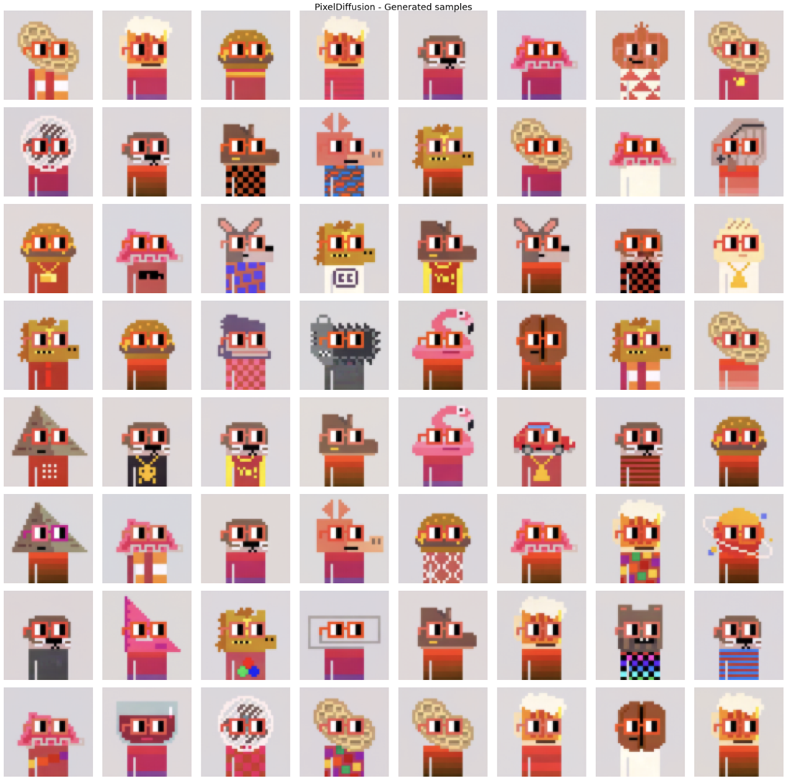
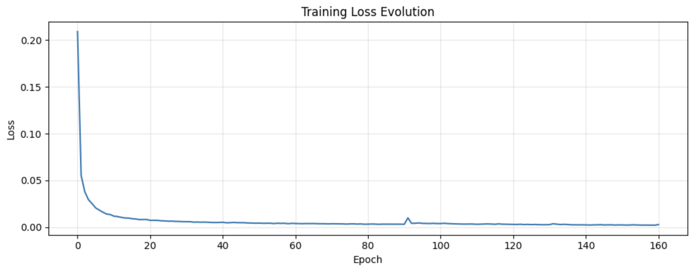
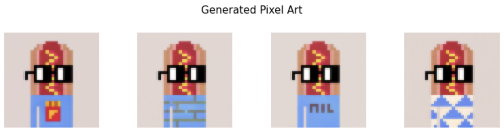
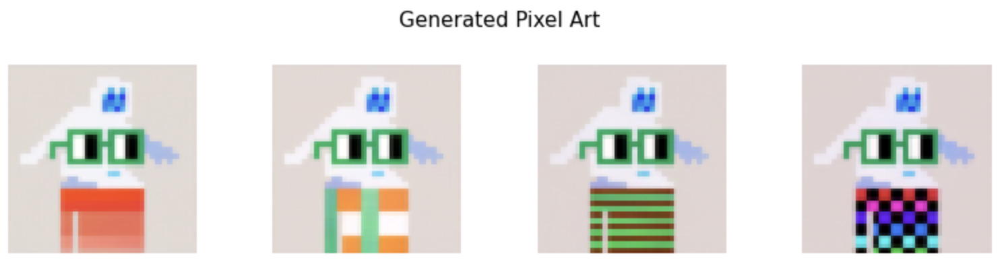

Hi, I built this model to deepen my understanding of DDPM, text-conditioned generation, and UNet architecture.

Everything is coded from scratch, even when it comes at some computational cost (I'm thinking about Self-Attention in the UNet).

The model generates 64x64 pixel art images. I first trained it unconditionally, then added a text conditioner to guide generation.

Project structure:
- `configs/` : training configs
- `deprecated/`: deprected notebooks, kept for reference
- `models/` : model classes
- `notebook/` : training and sampling notebooks (used on Kaggle)
- `training/` : Trainer class
- `utils/` : utility functions

Here are some results:

### Unconditional sampling

A grid of 64x64 pixel art characters generated without any text conditioning.

### Training loss

Training loss curve over the course of the diffusion model training.

### Text-conditioned generation

**Prompt:** "a character with square black glasses and a hotdog-shaped head and a blue-colored body on a warm background"

**Prompt:** "a character with dark green glasses and a yeti-shaped head and a teal-colored body on a warm background"

### Conclusion

The model generalizes decently : it follows the prompt structure and produces recognizable characters. But it stays limited: it can pick up individual attributes but can't really mix them (like combining two head shapes).

The custom tokenizer is the major problem. It only knows words from the training set, so anything a bit different breaks the conditioning. Switching to a pretrained tokenizer/encoder would help a lot.

I also never tracked validation loss during training, which makes it hard to know if the model overfit at some point.

One good point, there is no blurriness, generations are pretty good, which is a good sign for the diffusion process.
